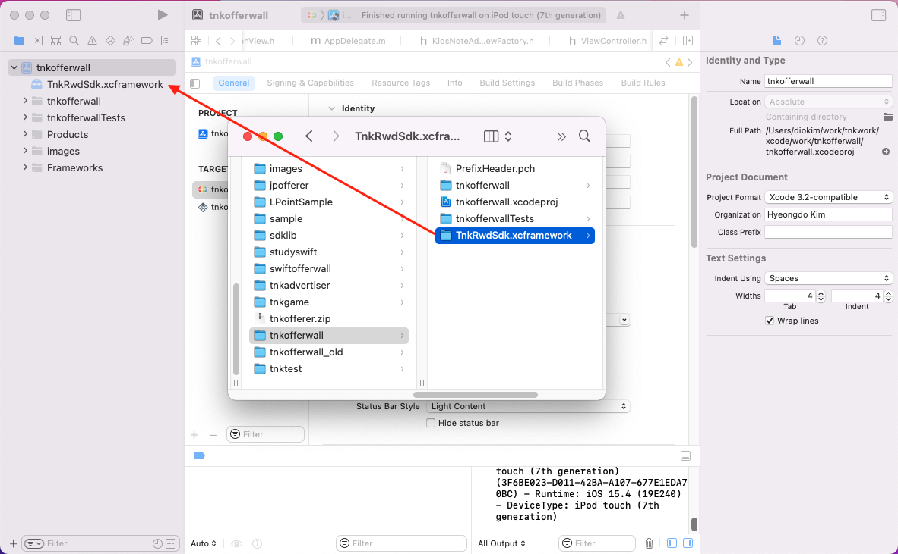
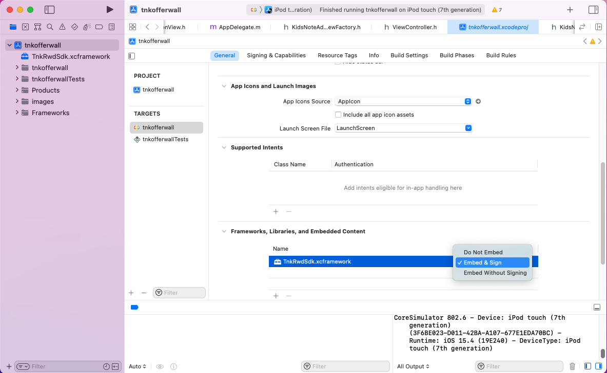
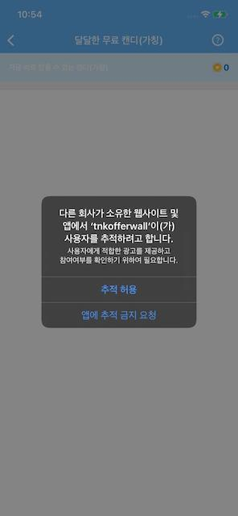
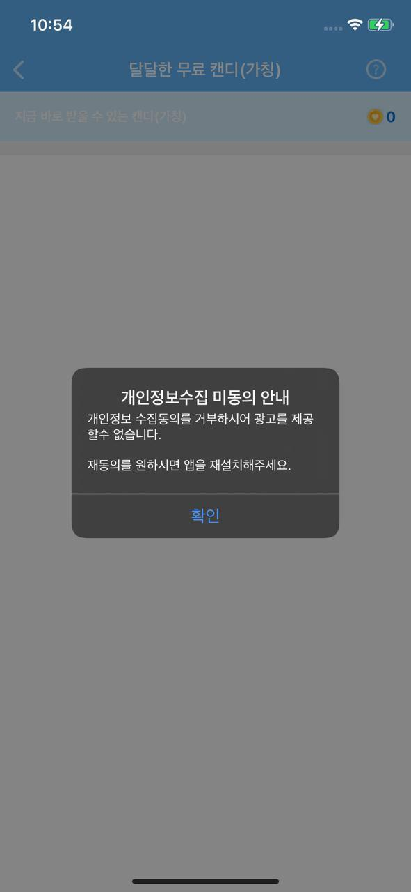
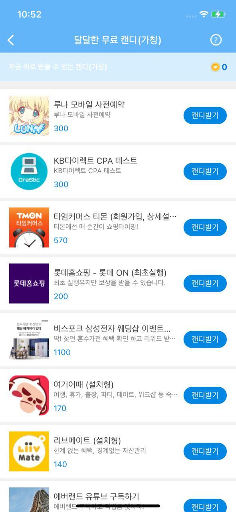
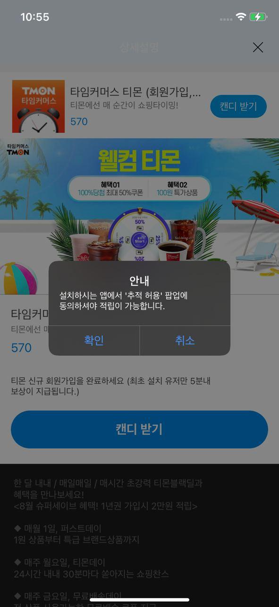
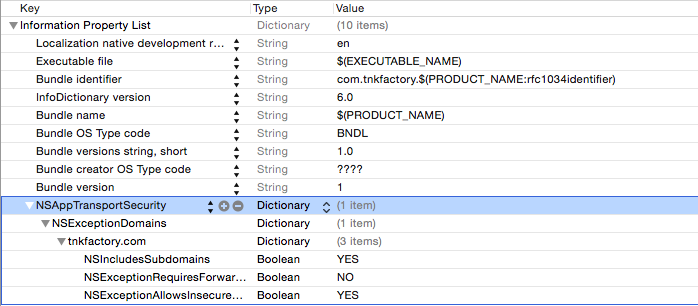
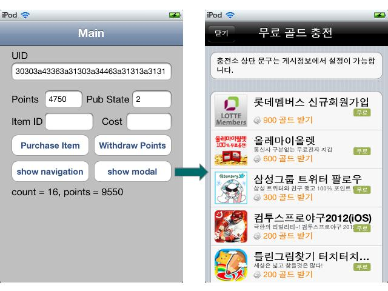
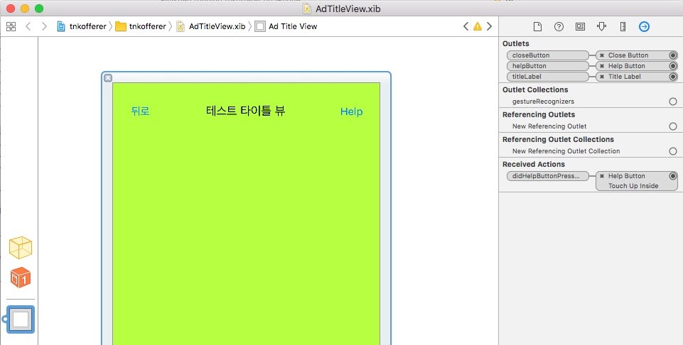
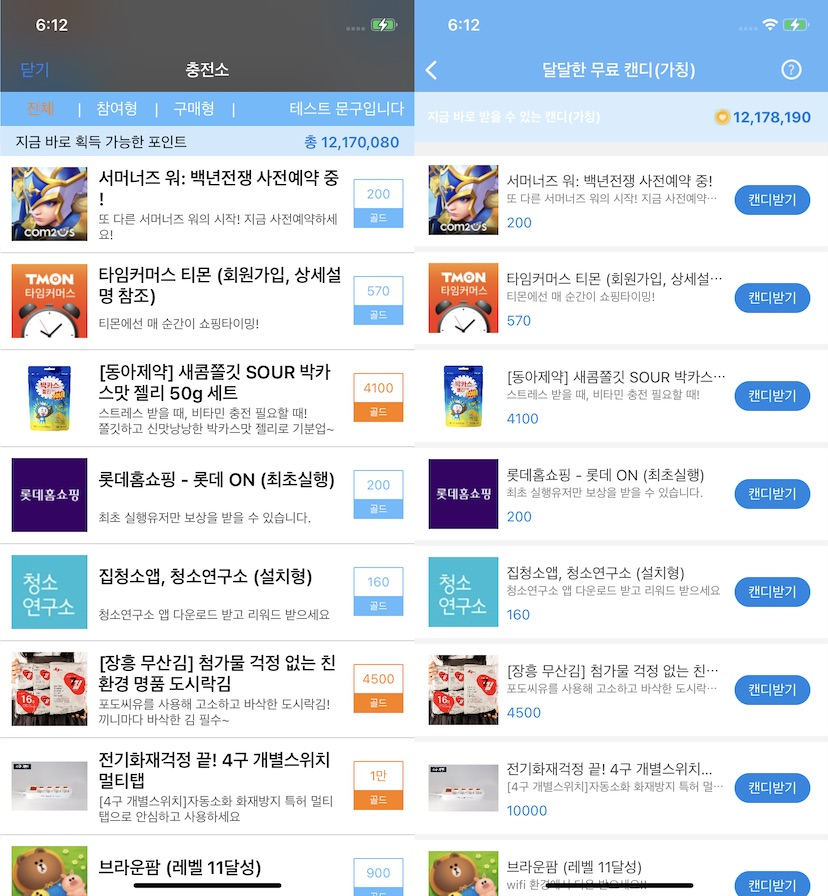

# Tnkfactory SDK Rwd

## 목차
1. [SDK 설정하기](#1-sdk-설정하기)

   * [라이브러리 다운로드](#라이브러리-다운로드-1)
   * [라이브러리 등록](#라이브러리-등록) 
   * [오퍼월의 처리 흐름](#오퍼월의-처리-흐름)
   * [Tnk 객체 초기화](#tnk-객체-초기화)
     * [초기화 API를 호출하는 방법](#초기화-api를-호출하는-방법)
     * [info.plist 파일에 APP_ID를 설정하는 방법](#infoplist-파일에-app_id를-설정하는-방법)
   * [App Transport Security 설정](#app-transport-security-설정)

2. [Publisher API](#2-publisher-api)

   가. [광고 목록 띄우기](#가-광고-목록-띄우기)

   * [유저 식별 값 설정](#유저-식별-값-설정)
     * [Method](#method)
     * [Parameters](#parameters)
     * [적용예시](#적용예시)
   * [TnkSession - showAdList~:title](#tnksession---showadlisttitle)
     * [Method](#method-1)
     * [Description](#description)
     * [Parameters](#parameters-1)
     * [적용예시](#적용예시-1)
   * [TnkAdListView](#tnkadlistview)
     * [Method](#method-2)
     * [Description](#description-1)
     * [Parameters](#parameters-2)
     * [적용예시](#적용예시-2)

   나. [포인트 조회 및 인출](#나-포인트-조회-및-인출)

      * [TnkSession - queryPoint](#tnksession---querypoint)

   * [TnkSession - purchaseItem](#tnksession---purchaseitem)
   * [TnkSession - withdrawPoints](#tnksession---withdrawpoints)

   다. [그밖의 기능들](#다-그밖의-기능들)

   * [TnkSession - queryPublishState](#tnksession---querypublishstate)
   * [TnkSession - queryAdvertiseCount](#tnksession---queryadvertisecount)

   라. [스타일 설정하기](#라-스타일-설정하기)

   * [광고 목록 스타일 설정](#광고-목록-스타일-설정)
   * [광고 상세 화면의 스타일 설정](#광고-상세-화면의-스타일-설정)
   * [적용예시](#적용예시-8)
   
   마. [Callback URL](#마-callback-url)

   * [호출방식](#호출방식)
   * [Parameters](#parameters-15)
   * [리턴값처리](#리턴값-처리)
   * [Callback URL 구현 예시 (Java)](#callback-url-구현-예시-java)

## 1. SDK 설정하기

### 라이브러리 다운로드

**[[SDK Download v4.38](./sdk/tnkrwd_sdk_ios_v4.38.zip)]**

**[[Unity Plugin Download v4.31](./sdk/tnkad.unitypackage)]**

### 프레임워크 등록
다운로드받은 SDK 압축파일을 풀면 TnkRwdSdk.xcframework 폴더가 생성됩니다. 해당 폴더를 적용하고자 하는 XCode 프로젝트 폴더로 이동시키세요.

폴더를 이동시켰으면 TnkRwdSDK.xcframework 폴더를 XCode 내에 마우스로 드래그합니다. 이후 XCode -> Target -> General -> Frameworks, Libraries, and Embedded Content 항목에 TnkRwdSdk.xcframework 가 있는 것을 확인하시고 Embed 설정을 Embed & Sign 으로 변경합니다.

아래의 이미지를 참고하세요.



##### Migration 안내
기존의 lib 파일을 적용하셨다면 해당 libtnksdk.a 파일과 tnksdk.h 헤더파일은 삭제해주세요.

그리고 #import "tnksdk.h" 로 작성하셨던 코드는 모두 #import <TnkRwdSdk/TnkRwdSdk.h> 로 수정해주세요.

**중요) 앱스토어 정책상 앱 보상형광고가 노출되는 경우 검수가 되지 않습니다.** 
**보상형 매체로 사용하시는 경우에는 앱 광고가 노출되지 않도록 앱스토어 검수전에 매체 설정이 필요하므로 사전에 저희쪽에 문의해주시면 안내해드리겠습니다.**

##### info.plist 파일에 "Privacy - Tracking Usage Description" 을 추가합니다. 추가되는 문구는 앱 추적 동의 팝업 창에 노출됩니다.

###### 작성예시

**사용자에게 적합한 광고를 제공하고 참여여부를 확인하기 위하여 광고ID를 수집합니다. 광고ID는 오퍼월 서비스를 제공하기 위해서 필수적인 항목으로 추적허용을 해주셔야 사용이 가능합니다.**


##### info.plists 파일에 아래의 SKAdNetwork ID 목록을 추가합니다. 이 내용은 iOS14 부터 추가된 내용이며 자세한 내용은 아래 링크에서 확인하실 수 있습니다.

[Configuring the Participating Apps](https://developer.apple.com/documentation/storekit/skadnetwork/configuring_the_participating_apps)

```
<key>SKAdNetworkItems</key>
<array>
  <dict>
    <key>SKAdNetworkIdentifier</key>
    <string>2U9PT9HC89.skadnetwork</string>
  <dict/>
  <dict>
    <key>SKAdNetworkIdentifier</key>
    <string>44jx6755aq.skadnetwork</string>
  <dict/>
  <dict>
    <key>SKAdNetworkIdentifier</key>
    <string>4FZDC2EVR5.skadnetwork</string>
  <dict/>
  <dict>
    <key>SKAdNetworkIdentifier</key>
    <string>4PFYVQ9L8R.skadnetwork</string>
  <dict/>
  <dict>
    <key>SKAdNetworkIdentifier</key>
    <string>737z793b9f.skadnetwork</string>
  <dict/>
  <dict>
    <key>SKAdNetworkIdentifier</key>
    <string>7UG5ZH24HU.skadnetwork</string>
  <dict/>
  <dict>
    <key>SKAdNetworkIdentifier</key>
    <string>8s468mfl3y.skadnetwork</string>
  <dict/>
  <dict>
    <key>SKAdNetworkIdentifier</key>
    <string>9RD848Q2BZ.skadnetwork</string>
  <dict/>
  <dict>
    <key>SKAdNetworkIdentifier</key>
    <string>9T245VHMPL.skadnetwork</string>
  <dict/>
  <dict>
    <key>SKAdNetworkIdentifier</key>
    <string>av6w8kgt66.skadnetwork</string>
  <dict/>
  <dict>
    <key>SKAdNetworkIdentifier</key>
    <string>c6k4g5qg8m.skadnetwork</string>
  <dict/>
  <dict>
    <key>SKAdNetworkIdentifier</key>
    <string>CJ5566H2GA.skadnetwork</string>
  <dict/>
  <dict>
    <key>SKAdNetworkIdentifier</key>
    <string>F38H382JLK.skadnetwork</string>
  <dict/>
  <dict>
    <key>SKAdNetworkIdentifier</key>
    <string>GLQZH8VGBY.skadnetwork</string>
  <dict/>
  <dict>
    <key>SKAdNetworkIdentifier</key>
    <string>hs6bdukanm.skadnetwork</string>
  <dict/>
  <dict>
    <key>SKAdNetworkIdentifier</key>
    <string>mlmmfzh3r3.skadnetwork</string>
  <dict/>
  <dict>
    <key>SKAdNetworkIdentifier</key>
    <string>prcb7njmu6.skadnetwork</string>
  <dict/>
  <dict>
    <key>SKAdNetworkIdentifier</key>
    <string>T38B2KH725.skadnetwork</string>
  <dict/>
  <dict>
    <key>SKAdNetworkIdentifier</key>
    <string>TL55SBB4FM.skadnetwork</string>
  <dict/>
  <dict>
    <key>SKAdNetworkIdentifier</key>
    <string>W9Q455WK68.skadnetwork</string>
  <dict/>
  <dict>
    <key>SKAdNetworkIdentifier</key>
    <string>wg4vff78zm.skadnetwork</string>
  <dict/>
  <dict>
    <key>SKAdNetworkIdentifier</key>
    <string>YCLNXRL5PM.skadnetwork</string>
  <dict/>
  <dict>
    <key>SKAdNetworkIdentifier</key>
    <string>ydx93a7ass.skadnetwork</string>
  <dict/>
    <dict>
    <key>SKAdNetworkIdentifier</key>
    <string>gvmwg8q7h5.skadnetwork</string>
  <dict/>
</array>
```

### 오퍼월의 처리 흐름

#### 오퍼월을 처음 사용하는 시점에 아래와 같이 앱추적 동의 팝업을 띄웁니다. 앱추적 동의는 iOS14에서 제공하는 기능으로 여기에서 사용자가 동의를 해야만 IDFA 값을 수집할 수 있습니다.



#### 앱추적 동의에 거부한 유저에게는 오퍼월 사용불가 안내 팝업을 띄웁니다.



#### 앱 추적을 동의한 유저에게만 광고 리스트가 노출 됩니다.



#### 실행형/액션형 광고는 설치한 광고앱에서도 사용자가 앱추적 동의를 해야합니다. 이를 위하여 앱스토어 이동전에 안내 팝업을 띄우도록 하였습니다.



### Tnk 객체 초기화

TnkAd SDK 사용전에 반드시 TnkSession 객체를 초기화해야 합니다. TnkSession 초기화는 2가지 방법을 제공합니다. 아래 2가지 방법 중 하나를 선택하시어 진행하시면 됩니다.

#### 초기화 API를 호출하는 방법

Application Delegate 내의 applicationDidFinishLaunchingWithOption 메소드 내에 아래와 같이 초기화 로직을 넣어주십시요.

 **\* APP_ID 값은 Tnk 사이트에서 앱 등록하면 발급받으실 수 있습니다. 이 값을 아래 초기화 로직의 your-application-id-from-tnk-site 부분에 넣어주셔야합니다.**

```objective-c
#import "tnksdk.h"

- (BOOL)application:(UIApplication *)application didFinishLaunchingWithOptions:(NSDictionary *)launchOptions
{
    // Tnk 초기화
    [TnkSession initInstance:@"your-application-id-from-tnk-site"];

    // ...
}
```

#### info.plist 파일에 APP_ID를 설정하는 방법

Xcode 프로젝트의 info.plist 파일을 찾아서 아래와 같이 "tnkad_app_id" 항목을 추가하고 APP_ID 값을 설정합니다. 이곳에 설정해두면 TnkSession 객체가 처음 사용되는 시점에 자동으로 초기화 됩니다.

 **\* APP_ID 값은 Tnk 사이트에서 앱 등록하면 발급받으실 수 있습니다. 이 값을 아래 화면과 같이 Value 항목에 설정합니다.**


### App Transport Security 설정

SDK v4.05 부터는 모든 통신이 HTTPS 로 이루어지므로 아래의 ATS 관련 설정을 하실 필요가 없습니다.
다만 SDK v4.04 이하 버전의 경우에는 iOS9 에서 SDK 가 올바르게 동작하기 위해서 아래의 내용을 앱의 plist 파일에 반드시 설정해주어야 합니다.

NSAppTransportSecurity 를 키로 Dictionary 값 NSExceptionDomains 을 등록하여 하위에 tnkfactory.com 을 설정합니다. 자세한 내용은 아래의 예시를 참고하세요.

#### iOS9 APP Transport Security 설정하기

```xml
<key>NSAppTransportSecurity</key>
<dict>
<key>NSExceptionDomains</key>
<dict>
<key>tnkfactory.com</key>
<dict>
<key>NSIncludesSubdomains</key>
<true/>
<key>NSExceptionRequiresForwardSecrecy</key>
<false/>
<key>NSExceptionAllowsInsecureHTTPLoads</key>
<true/>
</dict>
 </dict>
</dict>
```




## 2. Publisher API

게시앱(Publisher)을 위한 가이드입니다.

이를 위해서는 Tnk 사이트에서 앱 등록 및 XCode의 [SDK 설정하기](#1-sdk-설정하기)가 우선 선행되어야합니다.


Tnk의 SDK를 적용하여 게시앱을 구현하는 것은 크게 3단계로 이루어집니다.

1) Tnk 사이트에서 앱 등록 및 매체 정보 등록

2) 앱 내에 Tnk 충전소로 이동하는 버튼 구현

3) 사용자가 충전한 포인트 조회 및 사용

### 가. 광고 목록 띄우기

<u>테스트 상태에서는 테스트하는 장비를 개발 장비로 등록하셔야 광고목록이 정상적으로 나타납니다.</u>

#### 유저 식별 값 설정

앱이 실행되면 우선 앱 내에서 사용자를 식별하는 고유한 ID를 아래의 API를 사용하시어 Tnk SDK에 설정하시기 바랍니다. 

사용자 식별 값으로는 게임의 로그인 ID 등을 사용하시면 되며, 적당한 값이 없으신 경우에는 Device ID 값 등을 사용할 수 있습니다.

(유저 식별 값이 Device ID 나 전화번호, 이메일 등 개인 정보에 해당되는 경우에는 암호화하여 설정해주시기 바랍니다.) 

유저 식별 값을 설정하셔야 이후 사용자가 적립한 포인트를 개발사의 서버로 전달하는 callback 호출 시에  같이 전달받으실 수 있습니다.

##### Method

- (void) setUserName : (NSString *) userName

##### Parameters

| 파라메터 명칭 | 내용                                                         |
| ------------- | ------------------------------------------------------------ |
| userName      | 앱에서 사용자를 식별하기 위하여 사용하는 고유 ID 값 (로그인 ID 등)<br/>길이는 256 bytes 이하입니다. |

##### 적용예시

```objective-c
[[TnkSession sharedInstance] setUserName:loginId];
```

#### TnkSession - showAdList~:title

자신의 앱에서 광고 목록을 띄우기 위하여 TnkSession 객체의 showAdListAsModel:title 또는 showAdListNavigation:title 함수를 사용합니다.
모달뷰 형태로 광고 목록을 띄워주거나 네비게이션 컨트롤러 방식으로 목록을 띄워줍니다.

##### Method

- (void) showAdListAsModal: (UIViewController *) viewController title: (NSString *) title
- (void) showAdListNavigation: (UIViewController *) viewController title: (NSString *) title

##### Description

TnkSession 클래스가 제공하는 메소드로서 광고 목록 화면을 띄워줍니다. TnkSession의 sharedInstance 객체를 받아서 메소드를 호출해야하며 모달뷰 형태로 띄우거나(showAdListAsModal) 또는 네비게이션 컨트롤러의 하위레벨로 띄워줍니다(showAdListNavigation). 

##### Parameters

| 파라메터 명칭  | 내용                          |
| -------------- | ----------------------------- |
| viewController | 현재화면의 뷰컨트롤러 객체    |
| title          | 광고 리스트의 타이틀을 지정함 |


##### 적용예시

```objective-c
- (IBAction)showOfferListPressed:(id)sender {
    // 모달 창으로 광고띄우기
    [[TnkSession sharedInstance] showAdListAsModal:self title:@"무료 골드 충전"];
}
```



#### TnkAdListView

TnkAdListView 는 보상형 광고리스트를 제공하는 UIView 객체입니다. UIView 로 제공하기때문에 보다 유연하게 앱내에 광고리스트를 탑재할 수 있습니다.

##### TnkAdListView interface

```objective-c
@interface TnkAdListView : UITableView <UITableViewDelegate, UITableViewDataSource, UIAlertViewDelegate, TnkServiceCallback, UIGestureRecognizerDelegate>

- (id) initWithFrame:(CGRect)frame viewController:(UIViewController *)vc;
- (void) loadAdList;
- (void) updateAdList;
- (NSTimeInterval) getLastLoadingSeconds;

@end
```

TnkAdListView 생성하기

- (id) initWithFrame: (CGRect) frame viewController: (UIViewController *) vc;

생성하고자하는 TnkAdListView 의 크기와 UIViewController 객체를 파라메터로 전달합니다.
아래의 메소들은 TnkAdListView 에서 제공하는 기능들입니다.

  - (void) loadAdList;
      - 광고 목록을 서버에서 가져와 화면에 뿌려줍니다.
  - (void) updateAdList;
      - 현재 광고목록을 다시 화면에 뿌려줍니다. 서버에 새로 광고를 요청하지 않습니다. 
      - 화면의 크기나 방향이 변경되었을때 다시 광고리스트를 화면에 출력하기 위한 용도로 사용합니다.
  - (NSTimeInterval) getLastLoadingSeconds;
      - 마지막으로 서버에서 광고를 요청한 시간을 1970.1.1 기준으로 초(second)로 반환합니다.

아래의 예시는 TnkAdListView 를 사용하여 구현한 TestAdListViewController 소스입니다.

##### AdTitleView 소스

```objective-c
// AdTitleView.h
#import <UIKit/UIKit.h>

@interface AdTitleView : UIView

@property (nonatomic, weak) IBOutlet UIButton* closeButton;
@property (nonatomic, weak) IBOutlet UIButton* helpButton;
@property (nonatomic, weak) IBOutlet UILabel *titleLabel;

- (IBAction) didHelpButtonPressed:(id)sender;

@end

// AdTitleView.m
#import "AdTitleView.h"
#import "TnkSession.h"

@implementation AdTitleView


- (IBAction) didHelpButtonPressed:(id)sender {
    NSString *url = [[TnkSession sharedInstance] getHelpdeskUrl];
    NSURL *urlToOpen = [NSURL URLWithString:[NSString stringWithString:url]];
   
    [[UIApplication sharedApplication] openURL:urlToOpen];
}

@end
```



##### TestAdListViewController

```objective-c
// TestAdListViewController.h
#import <UIKit/UIKit.h>

@interface TestAdListViewController : UIViewController 

@end

// TestAdListViewController.m
#import "TestAdListViewController.h"
#import "AdTitleView.h"
#import "tnksdk.h"

#define HEADER_HEIGHT 60

@interface TestAdListViewController ()

@end

@implementation TestAdListViewController {
    AdTitleView *titleView;
    TnkAdListView *adlistView;
}

- (void) cancelPressed {
    [self.navigationController popViewControllerAnimated:YES];
}

- (void)viewDidLoad {
    [super viewDidLoad];
    // Do any additional setup after loading the view.

    titleView = (AdTitleView *)[[[NSBundle mainBundle] loadNibNamed:@"AdTitleView" owner:self options:nil] objectAtIndex:0];
    titleView.frame = CGRectMake(0, 0, self.view.bounds.size.width, HEADER_HEIGHT);
    titleView.autoresizingMask = UIViewAutoresizingFlexibleWidth;

    [titleView.closeButton addTarget:self action:@selector(cancelPressed) forControlEvents:UIControlEventTouchUpInside];

    [self.view addSubview:titleView];

    CGRect rect = CGRectMake(0, HEADER_HEIGHT, self.view.bounds.size.width, self.view.bounds.size.height - HEADER_HEIGHT);
    adlistView = [[TnkAdListView alloc] initWithFrame:rect viewController:self];
    adlistView.autoresizingMask = UIViewAutoresizingFlexibleWidth | UIViewAutoresizingFlexibleHeight;

    [self.view addSubview:adlistView];
}

- (void)viewWillAppear:(BOOL)animated
{
    [super viewWillAppear:animated];

    [adlistView loadAdList];
}

- (void)didReceiveMemoryWarning {
    [super didReceiveMemoryWarning];
    // Dispose of any resources that can be recreated.
}

- (BOOL)shouldAutorotateToInterfaceOrientation:(UIInterfaceOrientation)interfaceOrientation
{
    return UIInterfaceOrientationIsPortrait(interfaceOrientation);
}

- (void)didRotateFromInterfaceOrientation:(UIInterfaceOrientation)fromInterfaceOrientation {

    if (!self.isViewLoaded || !self.view.window) {
        // 현재 화면에 떠있지 않으면 무시한다.
        return;
    }

    [adlistView updateAdList];
}

- (void)viewWillTransitionToSize:(CGSize)size
       withTransitionCoordinator:(id<UIViewControllerTransitionCoordinator>)coordinator {

    if (!self.isViewLoaded || !self.view.window) {
        // 현재 화면에 떠있지 않으면 무시한다.
        return;
    }

    [coordinator animateAlongsideTransition:^(id<UIViewControllerTransitionCoordinatorContext> context)
     {
         // do whatever
     } completion:^(id<UIViewControllerTransitionCoordinatorContext> context)

     {
         [adlistView updateAdList];
     }];

    [super viewWillTransitionToSize:size withTransitionCoordinator:coordinator];
}

@end
```

### 나. 포인트 조회 및 인출

사용자가 광고참여를 통하여 획득한 포인트는 Tnk서버에서 관리되거나 앱의 자체서버에서 관리될 수 있습니다.

포인트가 Tnk 서버에서 관리되는 경우에는 다음의 포인트 조회 및 인출 API를 사용하시어 필요한 아이템 구매 기능을 구현하실 수 있습니다.

#### TnkSession - queryPoint

Tnk서버에 적립되어 있는 사용자 포인트 값을 조회합니다. TnkSession의 sharedInstance로 객체를 얻어와 호출하셔야합니다.
동기 방식과 비동기 방식 2가지 호출 방식을 제공하고 있으며 화면 멈춤 현상이 없도록 구현하기 위해서는 비동기 방식을 사용할 것을 권장합니다.
다만 별도 Thread를 생성하여 동기 방식으로 호출하셔도 무관합니다.

##### [비동기로 호출하기]

###### Method 

  - (void) queryPoint: (id) target action: (SEL) action;

###### Description

Tnk 서버에 적립되어 있는 사용자 포인트 값을 조회합니다. 비동기 방식으로 호출되며 결과를 받으면 target 객체의 action이 호출됩니다. 

###### Parameters

| 파라메터 명칭 | 내용                                                         |
| ------------- | ------------------------------------------------------------ |
| target        | 결과를 받으면 이 객체의 action 메소드가 호출된다.            |
| action        | 결과를 받으면 호출될 메소드를 지정한다. 메소드 호출 시 현재 포인트 값이 파라메터로 전달되므로 메소드는 (NSNumber *) 파라메터를 하나 받을 수 있도록 정의한다. |

###### 적용예시

```objective-c
- (void) pointReceived:(NSNumber *)point {
    [self.userPoints setText:[point stringValue]]; 
}

- (void)viewWillAppear:(BOOL)animated
{
    [super viewWillAppear:animated];

    // 현재 포인트 조회 (비동기 방식 호출)
    [[TnkSession sharedInstance] queryPoint:self action:@selector(pointReceived:)];
```

##### [동기방식으로 호출하기]

###### Method 

  - (NSInteger) queryPoint;

###### Description

Tnk 서버에 적립되어 있는 사용자 포인트 값을 조회합니다. 동기방식으로 호출되며 조회된 포인트 값을 반환합니다. 

###### Return

  - Tnk 서버에 적립되어 있는 포인트 값 (NSInteger)

###### 적용예시

```objective-c
NSInteger userPoint = [[TnkSession sharedInstance] queryPoint];
```

#### TnkSession - purchaseItem

TnK 서버에서는 별도로 아이템 목록을 관리하는 기능을 제공하지는 않습니다. 
다만 게시앱에서 제공하는 아이템을 사용자가 구매할 때 Tnk 서버에 해당 포인트 만큼을 차감 할 수 있습니다. TnkSession의 sharedInstance로 객체를 얻어와 호출하셔야하며 비동기 방식으로 동작합니다.

###### Method 

  - (void) purchaseItem: (NSString *) itemId cost: (NSInteger) poinCost target: (id) target action: (SEL) action;

###### Description

Tnk 서버에 적립되어 있는 사용자 포인트를 차감합니다. 차감내역은 Tnk사이트의 보고서 페이지에서 조회하실 수 있습니다.

###### Parameters

| 파라메터 명칭 | 내용                                                         |
| ------------- | ------------------------------------------------------------ |
| itemId        | 구매할 아이템의 고유 ID (게시앱에서 정하여 부여한 ID) Tnk 사이트의 보고서 페이지에서 함께 보여줍니다. |
| pointCost     | 차감할 포인트                                                |
| target        | 결과를 받으면 이 객체의 action 메소드가 호출된다.            |
| action        | 결과를 받으면 호출될 메소드를 지정한다. NSNumber 객체 2개를 파라메터로 받으며 첫번째 파라메터에는 차감 후 남은 포인트 값이 전달되고, 두번째 파라메터에는 고유한 거래 Id 값이 전달된다. 포인트 부족 또는 네트워크/시스템 오류로 인해 구매가 수행되지 못한 경우에는 두번째 파라메터 값으로 음수가 전달된다. |

###### 적용예시

```objective-c
- (void) purchaseResultReceived:(NSNumber *)pointRemain transactionId:(NSNumber *)trId {
    [self.userPoints setText:[pointRemain stringValue]];

    if ([trId integerValue] < 0) {
        // error
        UIAlertView *viewAlert = [[UIAlertView alloc] initWithTitle:@"purchaseItem Error" 
                                                            message:@"purchase Error!!!"
                                                           delegate:nil 
                                                  cancelButtonTitle:@"Confirm" 
                                                  otherButtonTitles:nil];

        [viewAlert show];

        [viewAlert autorelease]; 
    }
    else {
        // success
        UIAlertView *viewAlert = [[UIAlertView alloc] initWithTitle:@"purchaseItem Success" 
                                                            message:[trId stringValue]
                                                           delegate:nil 
                                                  cancelButtonTitle:@"Confirm" 
                                                  otherButtonTitles:nil];

        [viewAlert show];

        [viewAlert autorelease]; 
    }
}

- (IBAction)purchaseItemPressed:(id)sender {
    // 충전된 포인트로 아이템 구매등 포인트 사용하기
    NSInteger pointCost = [self.itemCost.text integerValue];
    [[TnkSession sharedInstance] purchaseItem:self.itemId.text 
                                                                cost:pointCost 
                                                             target:self 
                                                           action:@selector(purchaseResultReceived:transactionId:)];
}
```

#### TnkSession - withdrawPoints

Tnk 서버에서 관리되는 사용자 포인트 전체를 한번에 인출하는 기능입니다.

###### Method 

  - (void) withdrawPoints: (NSString *) desc target: (id) target action: (SEL) action;

###### Description

Tnk 서버에 적립되어 있는 사용자의 모든 포인트를 차감하고 차감된 포인트 값을 반환합니다. 차감내역은 Tnk사이트의 보고서 페이지에서 조회하실 수 있습니다.

###### Parameters

| 파라메터 명칭 | 내용                                                         |
| ------------- | ------------------------------------------------------------ |
| desc          | 인출과 관련된 설명 등을 넣어줍니다. Tnk 사이트의 보고서 페이지에서 함께 보여줍니다. |
| target        | 결과를 받으면 이 객체의 action 메소드가 호출된다.            |
| action        | 결과를 받으면 호출될 메소드를 지정한다. NSNumber 객체 1개를 파라메터로 받으며 차감된 포인트값이 전달된다. |

###### 적용예시

```objective-c
- (void) withdrawPointsReceived:(NSNumber *)points {
    NSLog(@"WithdrawPointsReceived %d", [points intValue]);
}

- (IBAction) didWithdrawButtonPressed:(id)sender {    
    [[TnkSession sharedInstance] withdrawPoints:@"test" target:self action:@selector(withdrawPointsReceived:)];
}
```

### 다. 그밖의 기능들

#### TnkSession - queryPublishState

Tnk 사이트의 [게시정보]에서 광고 게시 중지를 하게 되면 이후에는 사용자가 광고 목록 창을 띄워도 광고들이 나타나지 않습니다.
그러므로 향후 광고 게시를 중지할 경우를 대비하여 화면에 충전소 버튼 자체를 보이지 않게 하는 기능을 갖추는 것이 바람직합니다.
이를 위하여 현재 게시앱의 광고게시 상태를 조회하는 기능을 제공합니다.

##### [비동기로 호출하기]

###### Method 

  - (void) queryPublishState: (id)target action: (SEL) action;

###### Parameters

| 파라메터 명칭 | 내용                                                         |
| -------------------------- | --------------------------------------------------- |
| target | 결과를 받으면 이 객체의 action 메소드가 호출된다.            |
| action | 결과를 받으면 호출될 메소드를 지정한다. 메소드 호출 시 현재의 게시 상태 값이 파라메터로 전달되므로 메소드는 (NSNumber *) 파라메터를 하나 받을 수 있도록 정의한다.  전달되는 상태값들은 "tnksdk.h" 파일을 참고한다. |

###### 적용예시

```objective-c
- (void) publishStateReceived:(NSNumber *) state {
    // 상태값에 따라서 충전소 이동 버튼을 보이게 하거나 숨긴다.
    if ([state integerValue] == TNK_STATE_YES) {
        // 광고목록 버튼 보이기
    }
    else {
        // 광고목록 버튼 숨기기
    }
}

- (void)viewWillAppear:(BOOL)animated
{
    [super viewWillAppear:animated];

    // 게시앱 상태 조회 (비동기 방식 호출)
    [[TnkSession sharedInstance] queryPublishState:self action:@selector(publishStateReceived:)];
}
```

##### [동기방식으로 호출]

###### Method

- (NSInteger) queryPublishState;

###### Return

- 현재 게시 상태 값을 반환한다. (tnksdk.h 내용 참고)

#### TnkSession - queryAdvertiseCount

광고 게시 상태를 확인하여 충전소 버튼을 보이게하거나 안보이게 하는 것으로도 충분히 좋지만 현재 광고 게시 상태라 하더라도 사용자에게 지급될 수 없는 광고가 하나도 없을 수도 있습니다. 그러므로 실제적으로 현재 적립 가능한 광고가 있는지 여부를 판단해서 버튼을 노출하는 것이 보다 바람직합니다.
이를 위하여 현재 적립가능한 광고 정보를 확인하는 기능을 아래와 같이 제공합니다.

##### Method 

  - (void) queryAdvertiseCount: (id) target action: (SEL) action;

##### Parameters

| 파라메터 명칭 | 내용                                                         |
| ------------- | ------------------------------------------------------------ |
| target        | 결과를 받으면 이 객체의 action 메소드가 호출된다.            |
| action        | 결과를 받으면 호출될 메소드를 지정한다. 메소드 호출 시 2개의 NSNumber 객체를 파라메터로 전달한다. 첫번째 파라메터에는 현재 적립 가능한 광고수가 담겨 있으며, 두번째 파라메터에는 적립가능한 포인트의 총합이 담겨 있다. |

##### 적용예시

```objective-c
- (void) adCountReceived:(NSNumber *)count point:(NSNumber *)point {

    if ([point integerValue] > 0) {
        // 광고목록 버튼 보이기
    }
    else {
        // 광고목록 버튼 숨기기
    }
}

- (void)viewWillAppear:(BOOL)animated
{
    [super viewWillAppear:animated];

    // 노출 광고 개수 등 정보 조회 (비동기 방식 호출)
    [[TnkSession sharedInstance] queryAdvertiseCount:self action:@selector(adCountReceived:point:)];
}
```

### 라. 스타일 설정하기

광고목록 창은 SDK에서 제공하는 기본 스타일을 그대로 사용하셔도 무방하지만, 앱의 UI와 통일감 있도록 스타일을 정의할 수 있습니다.



Tnk SDK는 광고 목록 및 상세 화면의 색상이나 이미지 등을 변경할 수 있도록 다음과 같은 API를 제공합니다. 모든 API는 TnkSession의 sharedInstance를 호출하여 얻어진 객체를 사용해서 호출해야야 합니다. 

(** 스타일 지정시 TableStyle은 UITableStylePlain으로 유지하시기 바랍니다.)

#### 광고 목록 스타일 설정

- (void) setBackgroundColor:(UIColor *)color; // 전체적으로 사용되는 배경색

- (void) setHeaderTitle:(NSString *)title; // 광고목록 상단(네비게이션바)에 표시되는 타이틀 문구
- (void) setHeaderColor:(UIColor *)color; // 상단 타이틀 문구 배경색
- (void) setHeaderTextColor:(UIColor *)color; // 상단 타이틀 문구 글자색

- (void) setHeaderHelpButtonImage:(UIImage *)image; // 광고목록 상단에 문의하기 버튼을 표시하기 위한 이미지
- (void) setHeaderCloseButtonImage:(UIImage *)image; // 광고목록을 Modal로 띄운경우 닫기버튼용 이미지
- (void) setHeaderButtonTintColor:(UIColor *)color; // 광고목록의 닫기 버튼의 텍스트 색상

- (void) setListItemBackgroundColorNormal:(UIColor *)color; // 리스트 배경색
- (void) setListItemBackgroundColorStripe:(UIColor *)color; // 리스트 홀수번째 줄의 배경색을 다르게 할 경우 지정
- (void) setListItemBackgroundColorHighlight:(UIColor *)color; // 리스트 눌렸을때의 색상

- (void) setTagNormalColor:(UIColor *)color; // 광고 항목의 포인트 표시 영역 : 기본 색상
- (void) setTagConfirmColor:(UIColor *)color; // 광고 항목의 포인트 표시 영역 : 설치확인 상태인 경우 색상
- (void) setTagPurchaseColor:(UIColor *)color; // 광고 항목의 포인트 표시 영역 : 구매형 광고의 색상을 다르게 할 경우 지정

- (void) setShowAdListFooter:(BOOL)yesno; // 광고목록 하단에 문의하기 및 SDK 버젼 표시를 위한 Footer 영역 표시여부, 기본값 YES

- (void) setAdListMenuTextColor:(UIColor *)color; // 광고목록 list 영역 섹션해더의 메뉴 글자색상
- (void) setAdListMenuSelectedColor:(UIColor *)color; // 광고목록 list 영역 섹션해더의 메뉴 글자색상 (selected state)
- (void) setAdListMenuBackgroundColor:(UIColor *)color; // 광고목록 list 영역 섹션해더의 메뉴 배경색상
- (void) setAdListSubMenuTextColor:(UIColor *)color; // 광고목록 list 영역 섹션해더의 하위메뉴 글자색상
- (void) setAdListSubMenuBackgroundColor:(UIColor *)color; // 광고목록 list 영역 섹션해더의 하위메뉴 배경색상
- (void) setAdListSubMenuPointColor:(UIColor *)color; // 광고목록 list 영역 섹션해더의 하위메뉴 포인트표시용 글자색상
- (void) setAdListSubMenuPointDesc:(NSString *)title; // 광고목록 list 영역 '지금 획득가능한 포인트' 문구 커스터 마이징
- (void) setAdListSubMenuPointFormat:(NSString *)title; // 광고목록 list 영역 포인트 표시 포맷문자열, %@ 포함해야함

#### 광고 상세 화면의 스타일 설정

- (void) setDetailHeaderColor:(UIColor *)color;  // 상세화면 네비게이션 바 배경색상 
- (void) setDetailHeaderTextColor:(UIColor *)color;  // 상세화면 네비게이션 바 글자색상
- (void) setDetailCloseButtonTintColor:(UIColor *)color; // 닫기 버튼 이미지 또는 문구 색상 
- (void) setDetailCloseButtonImage:(UIImage *)image; // 보상형광고 상세 화면에서 닫기버튼용 이미지
- (void) setDetailCloseButtonRight:(BOOL)yesno; // 오른쪽에 닫기 버튼 두기 (기본값 NO)

- (void) setDetailBackgroundColor:(UIColor *)color; // 상새화면 기본 배경색
- (void) setDetailTextColor:(UIColor *)color; // 상세화면 기본 글자색 
- (void) setDetailPointColor:(UIColor *)color; // 상세화면 포인트 글자색 

- (void) setDetailButtonImageNormal:(UIImage *)image;  // 상세화면 이동버튼의 기본 이미지
- (void) setDetailButtonImageHighlight:(UIImage *)image; // 상세화면 이동버튼의 눌렸을때 이미지
- (void) setDetailButtonTextColor:(UIColor *)color; // 상세화면 이동버튼의 텍스트 색상
- (void) setDetailButtonLabel:(NSString *)label; // 이동버튼 문구

#### 완전한 커스터마이징

- 색상이나 버튼이미지의 단순 변경이 아니라 화면의 디자인을 자체적으로 구현할 경우 아래의 Factory 클래스를 설정하여 구현할 수 있습니다. Factory 클래스 구현 방법은 별도로 문의 바랍니다.

- (void) setAdItemViewFactory:(AdListItemViewFactory *)factory; // 광고리스트 아이템 뷰 객체 생성용
- (void) setAdListSectionHeaderView:(UIView *)view; // 광고목록 list 영역의 Section header 를 표시하기 위한 자체 View를 설정

#### 적용예시

```objective-c
- (void) setOfferwallStyle {
    
    //
    // 공통 설정
    //
    [TnkSession sharedInstance].adListNavigationBarStyle = UIBarStyleBlack;
    [TnkSession sharedInstance].adDetailNavigationBarStyle = UIBarStyleDefault;
    
    // 오퍼월 상단에 문의하기 버튼을 노출하기 위하여 아래와 같이 버튼이미지를 설정한다.
    [TnkSession sharedInstance].headerHelpButtonImage = [UIImage imageNamed:@"kidsnote_helpdesk"];
    // 오퍼월 하단의 문의하기 버튼 영역을 숨기기 위하야 아래와 같이 설정한다.
    [TnkSession sharedInstance].showAdListFooter = NO;
    
    // 오퍼월 상세화면 네비게이션 바 배경색상
    [TnkSession sharedInstance].detailHeaderColor = [UIColor colorWithRed:(235)/255.0f
                                                                    green:(246)/255.0f
                                                                     blue:(255)/255.0f
                                                                    alpha:(255)/255.0f];
    [TnkSession sharedInstance].detailHeaderTextColor = [UIColor blackColor];
    
    // 네비게이션바의 아이콘 색상은 별도로 설정해야한다.
    [TnkSession sharedInstance].detailCloseButtonTintColor = [UIColor blackColor];
    
    // 오퍼월 상세화면의 닫기 버튼 이미지
    [TnkSession sharedInstance].detailCloseButtonImage = [UIImage imageNamed:@"kidsnote_detail_close"];
    // 오퍼월 상세화면의 닫기 버튼을 오른쪽에 둔다.
    [TnkSession sharedInstance].detailCloseButtonRight = YES;
    // 오퍼월 상세화면의 이동 버튼 문구
    [TnkSession sharedInstance].detailButtonLabel = @"캔디 받기";
    
    // 오퍼월 섹션 Header 영역에 "지금 바로 받을 수 있는 포인트" 표시하기 위한 custom view 를 설정한다.
    KidsNoteAdListHeaderView *headerView = (KidsNoteAdListHeaderView *)[[[NSBundle mainBundle] loadNibNamed:@"KidsNoteAdListHeaderView" owner:self options:nil] objectAtIndex:0];
    headerView.frame = CGRectMake(0, 0, self.view.bounds.size.width, HEADER_HEIGHT);
    headerView.autoresizingMask = UIViewAutoresizingFlexibleWidth;
    
    [TnkSession sharedInstance].adListSectionHeaderView = headerView;
    
    // list item 사이의 분리 라인 없애기
    [TnkSession sharedInstance].tableViewSeparatorStyle = UITableViewCellSeparatorStyleNone;
    
    // 커스터마이징용 View 를 생성하기위한 Factory 객체를 설정한다.
    [TnkSession sharedInstance].adItemViewFactory = [[KidsNoteAdListItemViewFactory alloc] init];
    
    // 서버로 총 포인트 조회 요청을 한다. (포인트 업데이트 필요시 마다 호출한다.)
    [[TnkSession sharedInstance] queryAdvertiseCount:self action:@selector(adCountReceived:point:)];
    
}
```


### 마. Callback URL

사용자가 광고참여를 통하여 획득한 포인트를 개발사의 서버에서 관리하실 경우 다음과 같이 진행합니다.

* 매체 정보 설정 화면에서 아래와 같이 '포인트 관리' 항목을 '자체서버에서 관리'로 선택합니다.
* URL 항목에 포인트 적립 정보를 받을 URL을 입력합니다.

이후에는 사용자에게 포인트가 적립될 때 마다 실시간으로 위 URL로 적립 정보를 받을 수 있습니다.


##### 호출방식

HTTP POST

##### Parameters

| 파라메터   | 상세 내용                                                    | 최대길이 |
| ---------- | ------------------------------------------------------------ |---- |
| seq_id     | 포인트 지급에 대한 고유한 ID 값이다. URL이 반복적으로 호출되더라도 이 값을 사용하여 중복지급여부를 확인할 수 있다. | string(50) |
| pay_pnt    | 사용자에게 지급되어야 할 포인트 값이다.                      | long |
| md_user_nm | 게시앱에서 사용자 식별을 하기 위하여 전달되는 값이다. 이 값을 받기 위해서는 매체앱내에서 setUserName() API를 사용하여 사용자 식별 값을 설정하여야 한다. | string(256) |
| md_chk     | 전달된 값이 유효한지 여부를 판단하기 위하여 제공된다. 이 값은 app_key + md_user_nm + seq_id 의 MD5 Hash 값이다. app_key 값은 앱 등록시 부여된 값으로 Tnk 사이트에서 확인할 수 있다. | string(32) |
| app_id     | 사용자가 참여한 광고앱의 고유 ID 값이다.                     | long |
| pay_dt     | 포인트 지급시각이다. (System milliseconds) 예) 1577343412017 | long |
| app_nm     | 참여한 광고명 이다.                                          |  string(120) |
|pay\_amt|정산되는 금액.|long|
|actn\_id|<p>- 0 : 설치형</p><p>- 1 : 실행형</p><p>- 2 : 액션형</p><p>- 5 : 구매형</p>|int|

##### 리턴값 처리

Tnk 서버에서는 위 URL을 호출하고 HTTP 리턴코드로 200이 리턴되면 정상적으로 처리되었다고 판단합니다. 
만약 200이 아닌 값이 리턴된다면 Tnk 서버는 비정상처리로 판단하고 이후에는 5분 단위 및 1시간 단위로 최대 24시간 동안 반복적으로 호출합니다.

* 중요! 동일한 Request가 반복적으로 호출될 수 있으므로 seq_id 값을 사용하시어 반드시 중복체크를 하셔야합니다.


##### Callback URL 구현 예시 (Java)

```java
// 해당 사용자에게 지급되는 포인트

int payPoint = Integer.parseInt(request.getParameter("pay_pnt"));

// tnk 내부에서 생성한 고유 번호로 이 거래에 대한 Id이다.

String seqId = request.getParameter("seq_id");

// 전달된 파라메터가 유효한지 여부를 판단하기 위하여 사용한다. (아래 코딩 참고)

String checkCode = request.getParameter("md_chk");

// 게시앱에서 사용자 구분을 위하여 사용하는 값(전화번호나 로그인 ID 등)을 앱에서 TnkSession.setUserName()으로 설정한 후 받도록한다.

String mdUserName = request.getParameter("md_user_nm");

// 앱 등록시 부여된 app_key (tnk 사이트에서 확인가능)

String appKey = "d2bbd...........19c86c8b021";

// 유효성을 검증하기 위하여 아래와 같이 verifyCode를 생성한다. DigestUtils는 Apache의 commons-codec.jar 이 필요하다. 다른 md5 해시함수가 있다면 그것을 사용해도 무방하다.

String verifyCode = DigestUtils.md5Hex(appKey + mdUserName + seqId);

// 생성한 verifyCode와 chk_cd 파라메터 값이 일치하지 않으면 잘못된 요청이다.

if (checkCode == null || !checkCode.equals(verifyCode)) {

    // 오류

    log.error("tnkad() check error : " + verifyCode + " != " + checkCode);

} else {

    log.debug("tnkad() : " + mdUserName + ", " + seqId);


    // 포인트 부여하는 로직수행 (예시)

    purchaseManager.getPointByAd(mdUserName, payPoint, seqId);

}
```
